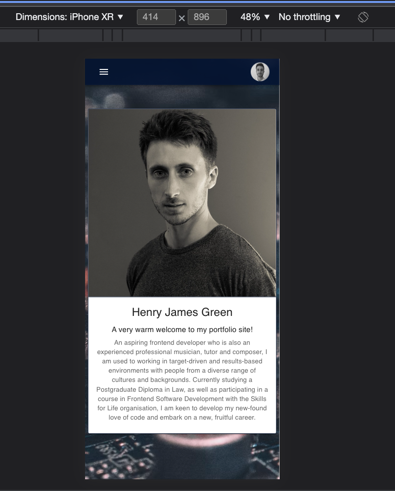
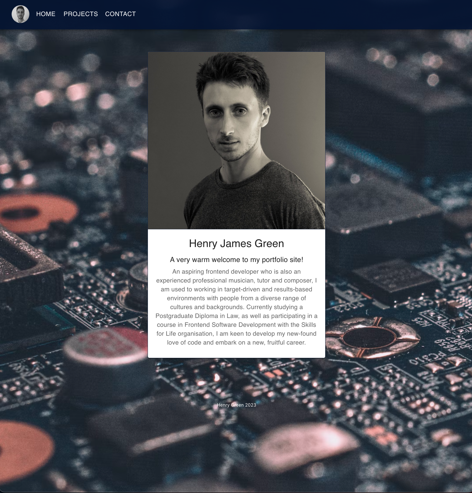

# henrys-react-portfolio-app

An application made with React, which displays my work, CV, social links and contact details.

- [Installation](#Installation)
- [Usage](#Usage)
- [License](#License)
- [Contributing](#Contributing)
- [Tests](#Tests)
- [Questions](#Questions)

## Installation

N/A

## Usage

Wesbite Link: https://henrys-portfolio.netlify.app/

To access my online portfolio, click the above link. upon clicking, you will be directed to the 'Home' page, complete with a headshot, a little bit about me, and an indication that this is a portfolio site. If you click on the 'Projects' tab, displayed in the responsive nav (or 'app' in MUI) bar, you will be presented with six dynamically displayed projects, complete with a screengrab and their names. upon clicking on one of these projects, you will find a screengrab, title and desciption, with a buttons directing the user to 'view code' and/or 'view repo' (please note, if no link is available, just the repo button willl display). Clicking the link will allow you to just as the button title says for that particular project. Note there is also a button to take you back to the projects page, to save the user cycling through the navbar, for improved UI experience.

On the 'Contact' page, the user is presented with a form for submission. This is also complete with a clickable email link, should the user prefer a more direct method, rather than a submission. The form itself consists of five input fields, four of which are required. Note these fields are also criteria-driven. Just below the form sits the 'submit' button. Finally, icons are displayed, on which you can click to view a pdf version of my CV, my github repo, and/or my LinkedIn profile. All pages are complete with a small footer.

## License

N/A

## Contributing

- https://www.youtube.com/watch?v=Q9n2mLqXFpU
- https://www.youtube.com/watch?v=IrCV1fF3Ls4
- https://stackoverflow.com/questions/39195687/setting-a-backgroundimage-with-react-inline-styles
- https://create-react-app.dev/docs/using-the-public-folder/#:~:text=To%20reference%20assets%20in%20the,an%20environment%20variable%20called%20PUBLIC_URL%20.&text=Only%20files%20inside%20the%20public,accessible%20by%20%25PUBLIC_URL%25%20prefix.
- https://mui.com/material-ui/getting-started/installation/
- https://www.npmjs.com/package/react-icons
- https://fontawesome.com/v5/docs/web/use-with/react

## Questions

GitHub profile - https://github.com/HenryJamesGreen

For more information/to ask questions, feel free to contact via email, at henryjamesgreen92@gmail.com. Thank you.
